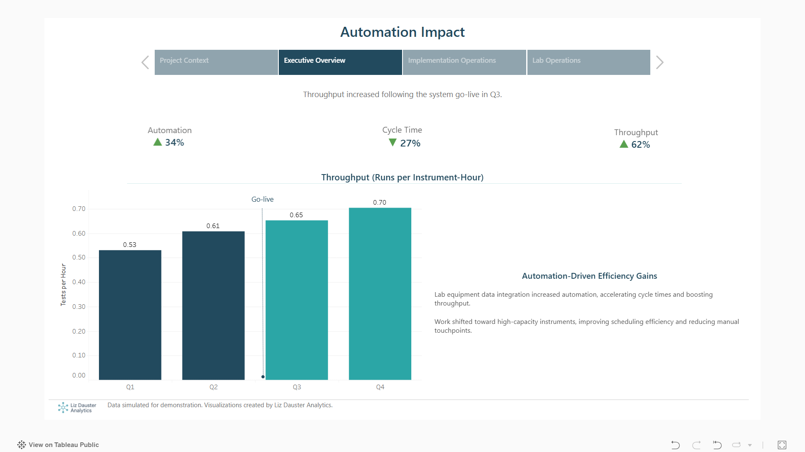
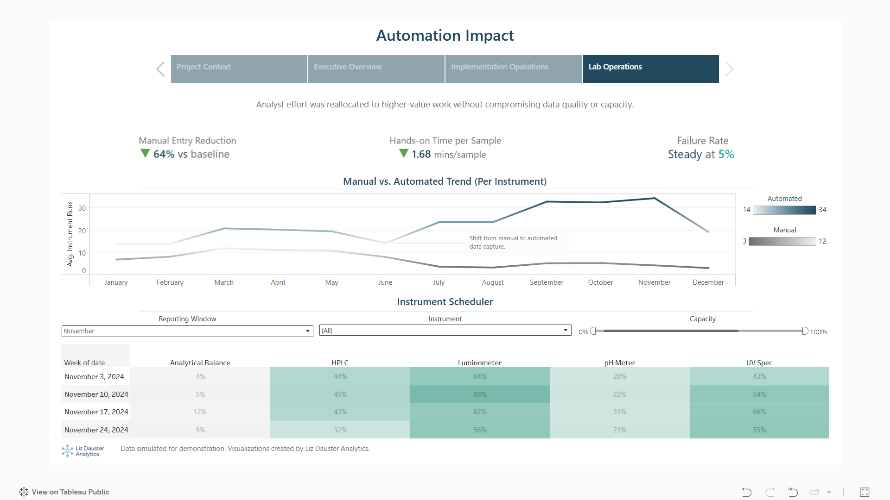

## Automation Impact - QC Lab Operations

This project is an applied data science case study evaluating the operational impact of integrating QC lab instruments with automation software using simulated laboratory data.

The analysis spans executive, implementation, and lab operations perspectives, examining throughput, utilization, available capacity, and analyst workflow changes under operational constraints.

### 🔗 Tableau Story (interactive):
[View the Automation Impact Dashboard](https://public.tableau.com/views/AutomationImpact-QCLabOperations/AutomationImpact?:language=en-US&:sid=&:redirect=auth&:display_count=n&:origin=viz_share_link)

### Key questions
- Did automation improve throughput and cycle time?
- How did instrument utilization and available capacity shift?
- How was analyst effort reallocated following system go-live?

### Analytical approach
- Use **runs per instrument-hour** as sample throughput
- Measure instrument utilization and available capacity
- Assess analyst workflow via manual vs automated runs
- Robust statistics (median, IQR) used for skewed operational data

### Data
The dataset is simulated and included in the `data/` directory to support reproducibility.

### Dashboards

#### Executive Overview

#### Implementation Operations

#### Lab Operations

## 🔬 Downtime Risk Analysis (Notebook)

In addition to the Tableau dashboard, this repository includes a structured analysis exploring operational drivers of instrument-day downtime risk.

The notebook:
- Aggregates run-level data to instrument-day to prevent leakage
- Evaluates baseline linear risk models
- Identifies nonlinear operational risk regimes using a shallow decision tree
- Emphasizes interpretability over predictive performance

### 📓 View the notebook:
[Instrument Downtime Risk Modeling](instrument_downtime_risk_modeling.ipynb)
