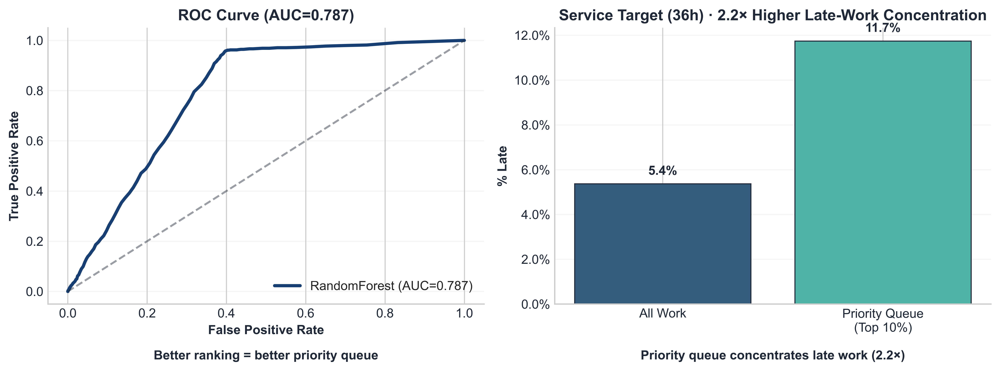
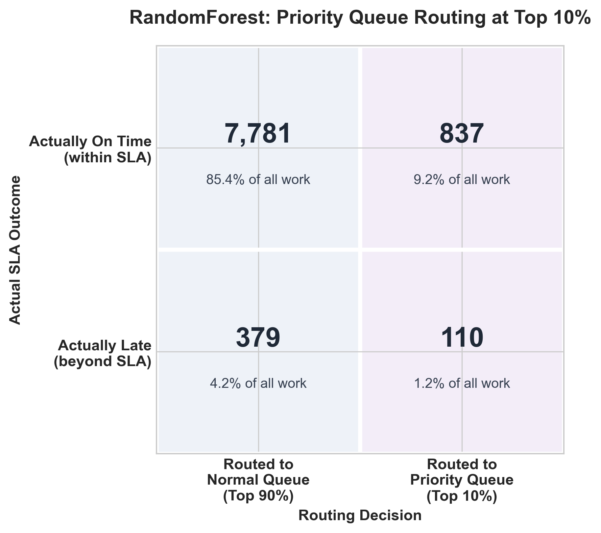

# ⚙️ Operational Analytics: Automation Impact & Cycle-Time Risk Routing

End-to-end operations analytics project demonstrating how operational workflow data can be structured, monitored, and modeled to support service-level performance.

---

## Business Question

Can operational telemetry identify work at elevated risk of extended cycle time early enough to support proactive routing decisions?

This project uses a synthetic laboratory operations dataset to demonstrate:

* KPI design for automation impact monitoring
* dashboard-based operational measurement
* cycle-time risk modeling
* top-risk priority queue routing

---

## Key Takeaways

* Designed a reproducible synthetic operations workflow with documented assumptions.
* Built weekly KPIs for throughput, utilization, downtime, manual-entry rate, turnaround time, and failure rate.
* Created dashboards to compare operational patterns before and after a simulated automation implementation.
* Trained a risk model to rank incoming work by probability of falling into the slowest 10% of cycle times.
* Evaluated a priority-routing policy that routes the top 10% highest-risk work items for earlier review.

---

## Workflow

| Step                      | Purpose                                                       | Artifact                      |
| ------------------------- | ------------------------------------------------------------- | ----------------------------- |
| **1. Generate data**      | Create synthetic event-level lab operations data              | `01_generate_data.ipynb`      |
| **2. Engineer KPIs**      | Aggregate raw events into weekly dashboard metrics            | `02_eda_and_kpis.ipynb`       |
| **3. Model risk routing** | Rank work by cycle-time risk and evaluate routing performance | `03_ops_ml_sla-routing.ipynb` |

---

## 1) Systems Framing

A business systems analysis describes how demand, capacity, utilization, variability, and queueing behavior affect cycle time.

* [Systems Analysis Brief](Workflow_automation_systems_analysis.pdf)


---

## 2) Operational Monitoring

Interactive Tableau dashboard tracking:

* throughput

* cycle time

* utilization

* manual-work rate

* downtime

* implementation-phase patterns

* [Interactive Dashboard](https://public.tableau.com/views/AutomationImpact-QCLabOperations/AutomationImpact?:language=en-US&:display_count=n&:origin=viz_share_link)


---

## 3) Cycle-Time Risk Routing

The modeling notebook evaluates whether intake data can be used to rank work by cycle-time risk.

**Target**

Predict risk of falling into the **slowest 10% of cycle times (P90)** within comparable work groups.

**Validation**

Uses **instrument-held-out GroupKFold** cross-validation to test whether the model generalizes beyond any single instrument.

**Decision Framing**

Rather than optimizing overall accuracy, the workflow evaluates whether the **top 10% highest-risk work items** contain a higher concentration of future delays than the full workload.





* [Notebook: Operational Risk Routing](03_ops_ml_sla-routing.ipynb)

---

## Reproducibility

This project can be run locally using the provided conda environment.

```bash
conda env create -f environment.yml
conda activate ops-ml
jupyter notebook
```

Run the notebooks in order:

```text
01_generate_data.ipynb
02_eda_and_kpis.ipynb
03_ops_ml_sla-routing.ipynb
```

All file paths are relative to the repository root.

---

## Limitations & Next Steps

**Limitations**

* Uses simulated operational data rather than production records.
* Automation effects are incorporated through documented simulation assumptions.
* Results demonstrate methodology and decision framing rather than real-world causal impact or ROI.

**Potential extensions**

* probability calibration
* temporal validation
* demand-shift scenario testing
* capacity-aware routing policies
* comparison of top-risk routing vs. staffing-constrained routing
