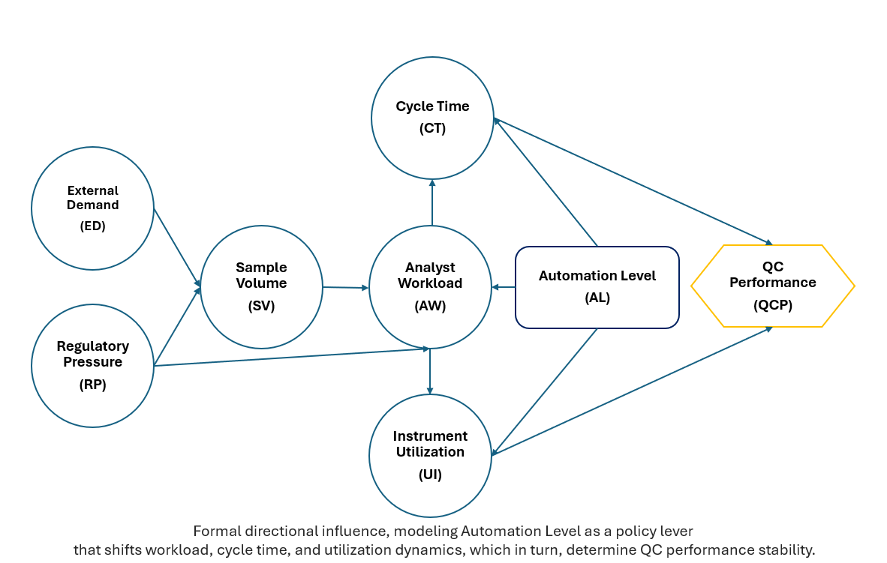
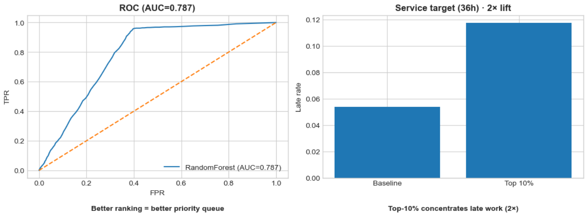

# Operational Analytics: Automation Impact and Cycle Time Risk Routing

Systems + measurement + modeling case study using simulated operational data.  
Focus: how workflow automation changes throughput and cycle time, and how to route work to protect time-based service targets (SLAs).

---

## What this project shows

- **Systems thinking:** feedback loops linking workload, variability, utilization, and cycle time
- **Operational measurement:** dashboards that quantify process changes over time
- **Operational ML:** a risk-ranking model that routes the top 10% highest-risk work to a priority queue and concentrates late work (service-target misses)

*Note: This project uses simulated data designed to reflect realistic operational patterns; the goal is to demonstrate methodology and decision framing.*

---

## Artifacts

### 1) Systems framing (brief)
A short systems analysis that explains why cycle time becomes unstable under congestion and how automation shifts regime behavior.

- [Systems Analysis Brief](Workflow_automation_systems_analysis.pdf)

<details>
  <summary><b>Preview: causal network</b></summary>

  

</details>

---

### 2) Operational measurement (Tableau)
Interactive dashboard evaluating:
- throughput and cycle time trends
- utilization signals
- manual work reduction
- stability of outcomes across phases

- [Interactive Dashboard](https://public.tableau.com/views/AutomationImpact-QCLabOperations/AutomationImpact?:language=en-US&:display_count=n&:origin=viz_share_link)

<details>
  <summary><b>Dashboard previews</b></summary>

  **Executive overview**  
  

  **Implementation operations**  
  

  **Operations view**  
  

</details>

---

### 3) Operational ML notebook (priority queue routing)
Builds an intake risk score to route the **top 10%** highest-risk work items to a priority queue.
- Target: **P90 slow cycle time** within comparable work (instrument type × test type)
- Validation: **instrument-held-out cross-validation** (GroupKFold)
- Stakeholder view: derived service-target threshold + **late-rate lift** in the routed queue

- [Notebook: Ops ML routing model](/ops-ml_sla-routing.ipynb)

<details>
  <summary><b>Notebook visuals</b></summary>

  

</details>

---

## Data

Simulated dataset stored in:
- `data/qc_instrument_usage.csv`

---

## Run locally (conda)

```bash
conda env create -f environment.yml
conda activate ops-ml
jupyter notebook
